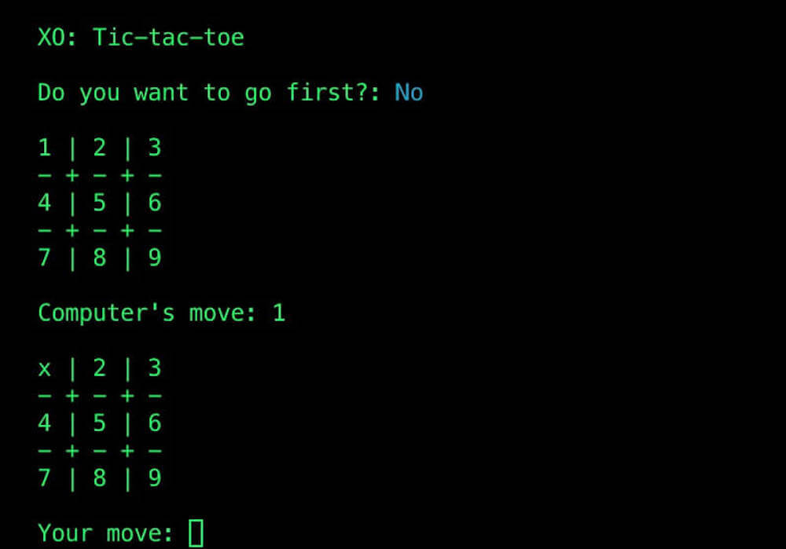

# XO
CLI game of tic-tac-toe written in Rust.



## Installation
1. Clone this repository:
    ```bash
    git clone --depth=1 https://github.com/marsbound/xo.git
    ```
2. Run the setup command to remove current .git:
    ```bash
    bash setup.sh
    ```
3. Build and run the game:
    ```bash
    cargo run
    ```

## License
[MIT](https://opensource.org/licenses/MIT)
